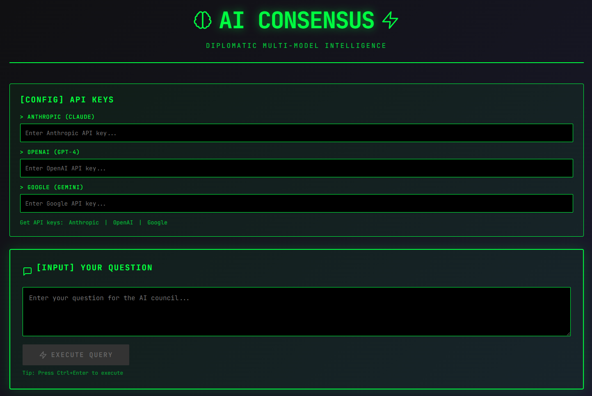
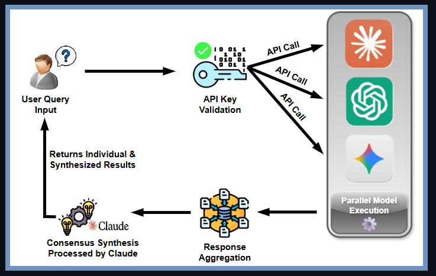
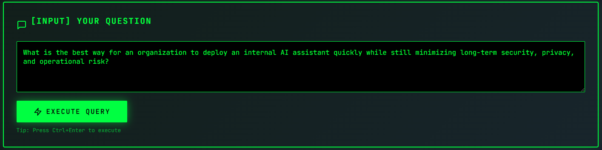
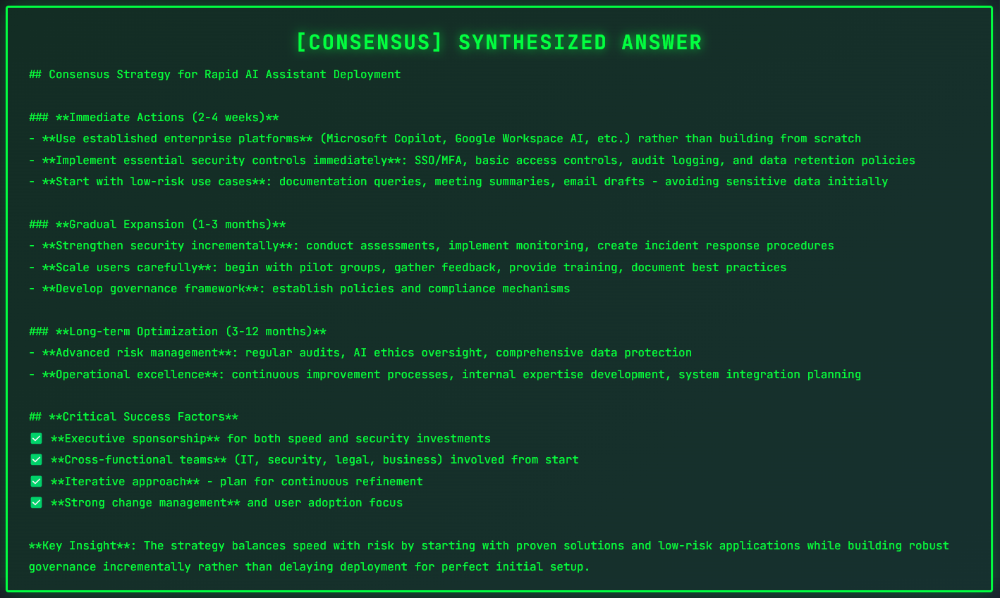

<h1 align="center">AI Consensus</h1>

_AI Consensus is a multi-model artificial intelligence interface that enables simultaneous querying of leading AI models (Claude, GPT-4, Gemini) and synthesizes their collective responses into a unified consensus output, providing users with comprehensive, cross-validated insights through a cyberpunk-themed terminal interface._

    Cyber-Engineering-Portfolio/
        └── projects/
                └──ai-consensus/
                    ├── src/                    # React application source code
                    ├── public/                 # Static assets and HTML template
                    ├── screenshots/            # Application interface captures
                    ├── architecture/           # System architecture and API flow diagrams
                    ├── README.md
                    └── deployment_guide.md     # Deployment and configuration instructions

## Current Project Status: `🟡 Early Development : In-Progress`

<p align="center">
  
</p>

## 🧠 Core Capabilities

_AI Consensus aims to integrate multiple popular AI models into a single query interface, with the original mental concept being a "diplomatic" decision made my multiple models to provide you the **BEST** possible response in one simple action._

- **Multi-Model Orchestration** – Simultaneous query execution across Claude (Anthropic), GPT-4 (OpenAI), and Gemini (Google) with parallel processing and real-time response streaming.
- **Consensus Synthesis** – Automated response aggregation and synthesis using Claude's advanced reasoning capabilities to identify commonalities, contradictions, and synthesized insights across model outputs.
- **Terminal-Inspired UI/UX** – Cool "Cyberpunk" aesthetic with terminal-style interface, smooth animations, real-time status indicators, and a simple execution keyboard shortcut (Ctrl+Enter).
- **Secure API Management** – Client-side API key handling with browser session storage (no server-side persistence), model selection / omission freedom, and graceful error handling with clear validation feedback.

<p align="center">
  
</p>

## 🏗️ Technical Architecture

### Frontend Stack
- **React 18.2** – Component-based UI architecture
- **Modern CSS** – Custom animations and cyberpunk theming
- **Responsive Design** – Optimized for desktop and tablet interfaces

### API Integration Layer
- **Anthropic API** – Claude Sonnet 4.5 for primary reasoning and synthesis
- **OpenAI API** – GPT-4 for comparative analysis
- **Google AI API** – Gemini Pro for additional perspective

### Data Flow Architecture
```
User Query Input
    ↓
[API Key Validation]
    ↓
[Parallel Model Execution]
    ├→ Claude API Call
    ├→ GPT-4 API Call  
    └→ Gemini API Call
    ↓
[Response Aggregation]
    ↓
[Consensus Synthesis via Claude]
    ↓
[Display Individual + Synthesized Results]
```

<p align="center">
  
</p>

## 🔧 Development Features

### Implemented
✅ Multi-model parallel query execution  
✅ Real-time response streaming and display  
✅ Consensus synthesis engine (Claude-powered)  
✅ Terminal aesthetic UI with animations  
✅ Keyboard shortcuts (Ctrl+Enter)  
✅ Client-side API key management  
✅ Error handling and validation  

### In Progress / Planned
📋 Response history and session management  
📋 Export functionality (JSON, Markdown, PDF)  
📋 Model performance comparison metrics  
📋 Advanced filtering and response analysis  
📋 Custom model weighting for synthesis 
📋 User authentication and persistent storage  
📋 Enterprise deployment configuration  
📋 Cost tracking and API usage analytics  
📋 Webhook integration for automated workflows  
📋 Plugin architecture for additional models 

## 🎨 Interface Preview

The application features a distinctive cyberpunk terminal aesthetic with:

- **Matrix-inspired color scheme** – Terminal green with dark backgrounds
- **Smooth animations** – Typewriter effects, fade-ins, and status indicators
- **Status feedback** – Real-time loading states and error messages
- **Responsive layout** – Optimized grid system for multiple model responses

## Query Functionality Input / Output Example

## 🧪 Featured Consensus Example

**Why This Matters**
This question intentionally invites multiple valid approaches. AI Consensus queries multiple frontier models in parallel, then synthesizes their responses to produce a balanced, actionable recommendation that reconciles competing priorities.


**INPUT** `User Question`
> What is the best way for an organization to deploy an internal AI assistant quickly while still minimizing long-term security, privacy, and operational risk?
<p align="center">
  
</p>

**OUTPUT SAMPLE** `Claude-Sythesized Response`
<p align="center">
  
</p>

**Why This Matters?**

This question intentionally invites multiple valid approaches. AI Consensus queries multiple frontier models in parallel, then synthesizes their responses to produce a balanced, actionable recommendation that reconciles competing priorities.


## 📋 API Requirements

To use AI Consensus, you'll need API keys from at least one provider:

| Provider | Model | Purpose | Required |
|----------|-------|---------|----------|
| **Anthropic** | Claude | Consensus synthesis & primary reasoning | ✅ Yes |
| **OpenAI** | GPT | Comparative analysis | ⚪ Optional |
| **Google** | Gemini | Additional perspective | ⚪ Optional |

**Note:** While Anthropic is required for consensus synthesis, the application will function with any single model for basic querying.

API Key Resources:
- [Anthropic Console](https://console.anthropic.com) – Claude API access
- [OpenAI Platform](https://platform.openai.com/api-keys) – GPT API access
- [Google AI Studio](https://makersuite.google.com/app/apikey) – Gemini API access

## 🔐 Security & Privacy
**No server-side storage** – All API keys remain client-side in browser memory
**Direct API communication** – Queries sent directly to model providers, no intermediary servers
**No data persistence** – Query history and responses are not stored (session-only)
**HTTPS enforcement** – All API communications encrypted
**No telemetry** – No usage analytics or tracking implemented

## 📄 License
**MIT License** - See `LICENSE.md` file for details

‎ 
<p align="center">
  <strong>AI Consensus</strong> – Diplomatic Multi-Model Intelligence<br>
  Built with React | Powered by Claude, GPT-4, and Gemini
</p>

<p align="center">
  <em>⚡ In Active Development | Not Ready for Public Use | Portfolio Showcase ⚡</em>
</p>
