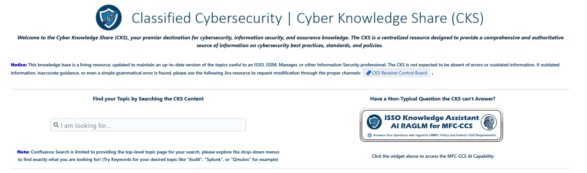
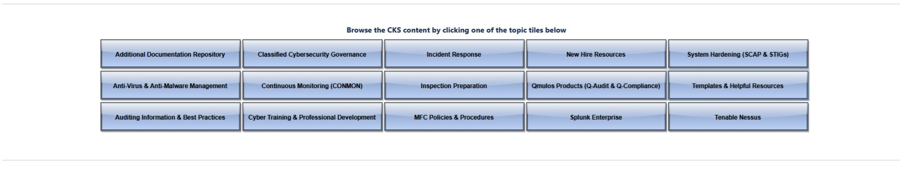
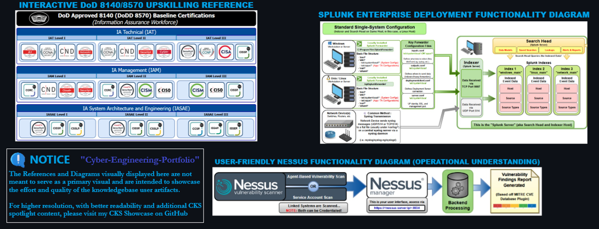
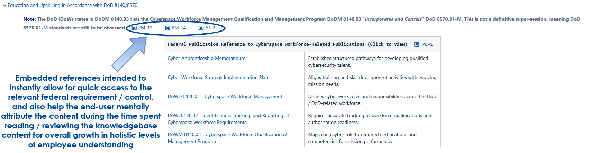
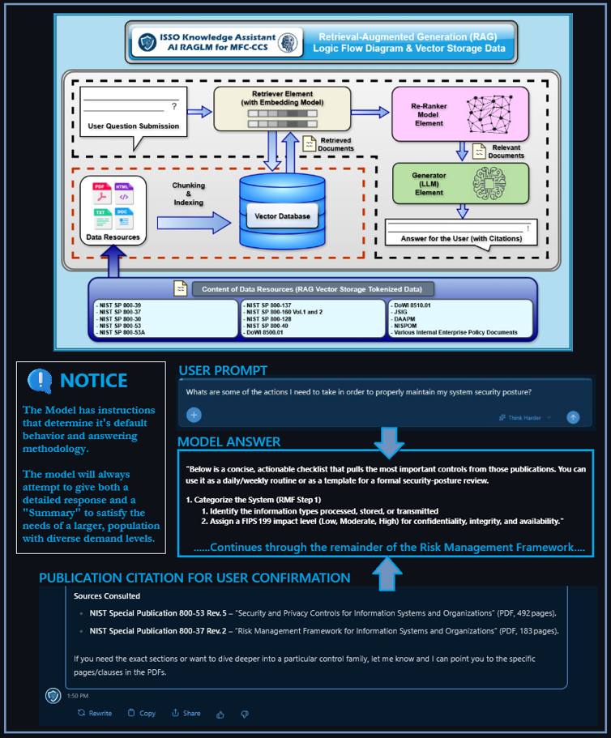

<h1 align="center">Cyber Knowledge Share (CKS)</h1>

_The Cyber Knowledge Share (CKS) is an enterprise-wide cybersecurity knowledge base a dedicated RAG AI Model that enables consistent, policy-aligned execution of cybersecurity governance and operations by centralizing authoritative guidance, enterprise policy, tooling references, and standardized workflows into a single, structured system for practitioners, auditors, and engineering staff._

    Cyber-Engineering-Portfolio/
        └── projects/
                └──cks/
                    ├── architecture/      #High-level CKS architecture and AI/RAG flow diagrams
                    ├── screenshots/       #Sanitized visuals of CKS pages, navigation, and capabilities
                    ├── README.md
                    └── scope_notice.md    #Public scope definition and sanitization notice

  

CKS content is organized into topic-based domains, including but not limited to:

- **Governance & Operations** – Policy-aligned guidance and standardized procedures covering classified cybersecurity governance, incident response, continuous monitoring (ConMon), inspection preparation, and auditing best practices to support consistent execution and inspection readiness.

- **Tooling** – Practical implementation guidance, operational references, and best practices for enterprise security tools including Splunk Enterprise, Tenable Nessus, system hardening (SCAP/STIG compliance), and anti-virus / anti-malware management.

- **Enterprise Enablement** – Enablement resources supporting workforce effectiveness and consistency, including new hire onboarding materials, standardized templates, enterprise policies and procedures, and curated DoD documentation repositories.

  

## Sampled Diagrams & Interactive Content

- [**DoD 8140/8570 Upskilling Reference**](https://github.com/ReeceNiemuth/Cyber-Engineering-Portfolio/blob/main/projects/cks/screenshots/CKS_child_page_showcase/8570_8140_interactive.jpg) → `screenshots/CKS_child_page_showcase/`  
  Interactive vendor and certification URL diagram mapping DoD cybersecurity certifications to recognized competency levels.

- [**Splunk Enterprise Deployment Diagram**](https://github.com/ReeceNiemuth/Cyber-Engineering-Portfolio/blob/main/projects/cks/screenshots/CKS_child_page_showcase/splunk_basics.jpg) → `screenshots/CKS_child_page_showcase/`  
  Overview of core Splunk components and enterprise data flow.

- [**Nessus Functional Workflow Diagram**](https://github.com/ReeceNiemuth/Cyber-Engineering-Portfolio/blob/main/projects/cks/screenshots/CKS_child_page_showcase/nessus_knowledgebase_webpage.jpg) → `screenshots/CKS_child_page_showcase/`  
  Simplified view of the Nessus scanning and vulnerability reporting process.

  

## Embedded Control & Policy Alignment

CKS integrates direct references to applicable regulatory and policy frameworks to support traceability and defensibility, including:

- **NIST SP 800-53** (Security Controls & Foundation for JSIG / DAAPM)
- **NIST SP 800-37** (Risk Management Framework)
- **NIST SP 800-39** (Enterprise Risk Management)
- **NIST SP 800-30** (Risk Assessment)
- Applicable DoD guidance and overlays
- Enterprise-specific cybersecurity policies and procedures

Where applicable, control references are embedded contextually alongside procedures and guidance to support real-world application rather than theoretical compliance.

  

## AI-Assisted Knowledge Access (RAG-LM)

CKS is augmented by an ISSO-focused AI Knowledge Assistant that provides accurate, standards-aligned guidance by retrieving from a curated corpus of authoritative NIST, DoD, and enterprise policy sources, reinforcing correct decision-making without replacing official documentation or human judgment.

  

## Governance & Content Management
CKS updates follow a CCB-like process involving SME review, approval, standardization, and accuracy validation before enterprise-wide communication of changes to workflows, policies, and requirements. All changes are tracked via a Jira-based ticketing and Kanban system to maintain version history, traceability, and ongoing reliability of the knowledge base.

## Scope Notice
This repository contains structural examples, templates, and representative artifacts only.  

**No proprietary, classified, or sensitive enterprise information is included.**

CKS is presented here as an architectural and governance reference demonstrating how enterprise cybersecurity knowledge bases can be structured, governed, and operationalized.

[**Please review**](https://github.com/ReeceNiemuth/Cyber-Engineering-Portfolio/blob/main/projects/cks/scope_notice.md) → `scope_notice.md`  
