

  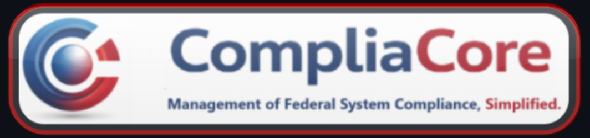

  
  
  

Desktop compliance platform designed for DoD and contractor environments intended to centralize security posture visibility and provide AI-assisted compliance decision support.

 

## Overview

CompliaCore aims to provide:

- Unified security and compliance posture metric visualization
- Holistic risk scoring across vulnerability assessment tools and baseline non-complaince findings.
- Offline AI "Subject Matter Expert" (RAG) for compliance guidance in sensitive air-gapped networks.
- Evidence-aware decision support for security professional workflows  

> **Quick Note:** **Home Dashboard** and **Findings Interface** utilize **sample data** and are for visual demonstration only at this time.

 

## Homepage: System Posture

**Unified view of system security and compliance KRIs in alignment to user-defined or provided framework parameters**

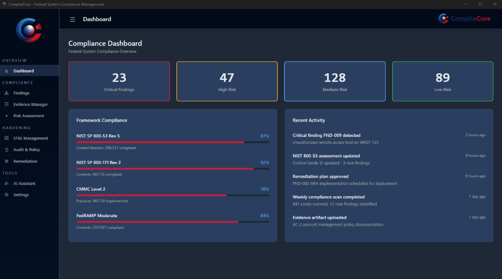

 

## CompliaCore UX Element Design & Direction

**Collapsed navigation mode for operational visibility, allows for user-friendly interface preference**

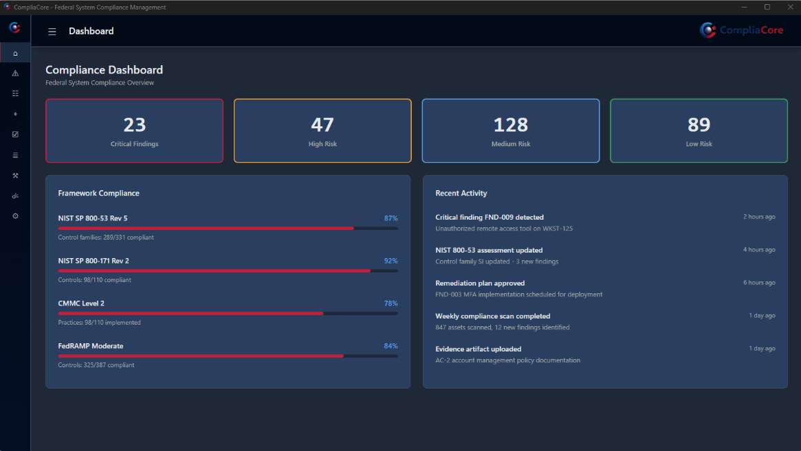

 

## Security Findings

**Aggregated assessment and baseline compliance findings with algorithmic risk calculation**

Combines the following:
- Nessus / OpenVAS severity (CVSS-based)
- SCAP / SCC STIG results (CAT I / II / III)

Produces a _holistic risk perspective_ across the environment.

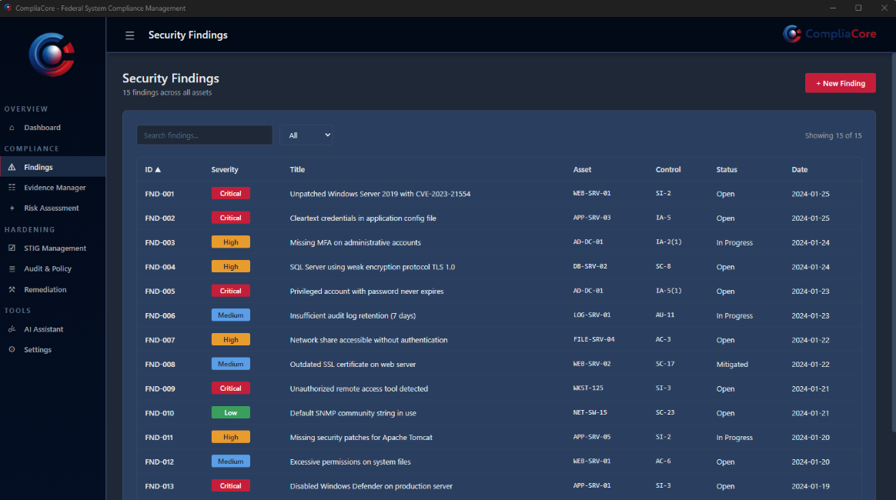

 

## Evidence Management

**Central repository serving as a reference interface and file management system for system security assessment artifacts and evidence**

Stores the following:
- Nessus / OpenVAS reports in HTML format
- SCAP / SCC STIG results (CAT I / II / III) in HTML format

Produces a simplified and centralized means of analyzing STIG and Nessus results across the entire environment.

#### Nessus Report Management / Reference Example

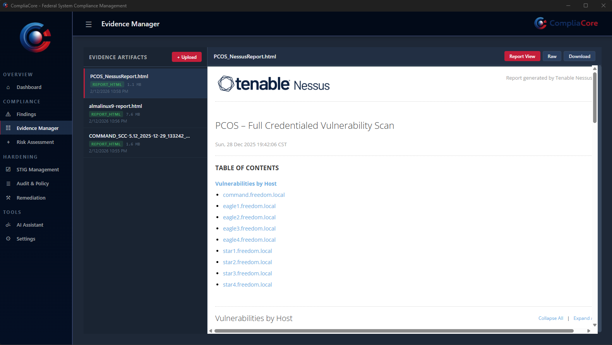

#### OpenSCAP Report Management / Reference Example (Linux-Based)

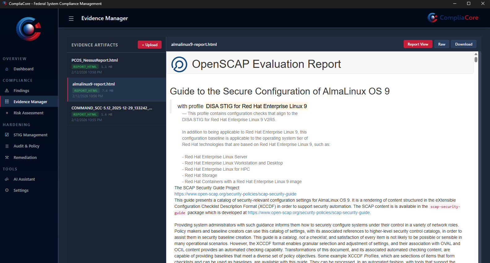
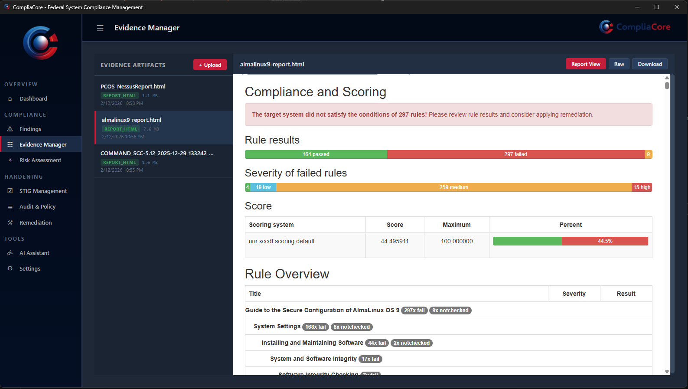

#### SCAP Compliance Checker (SCC) Report Management / Reference Example (Windows-Based)

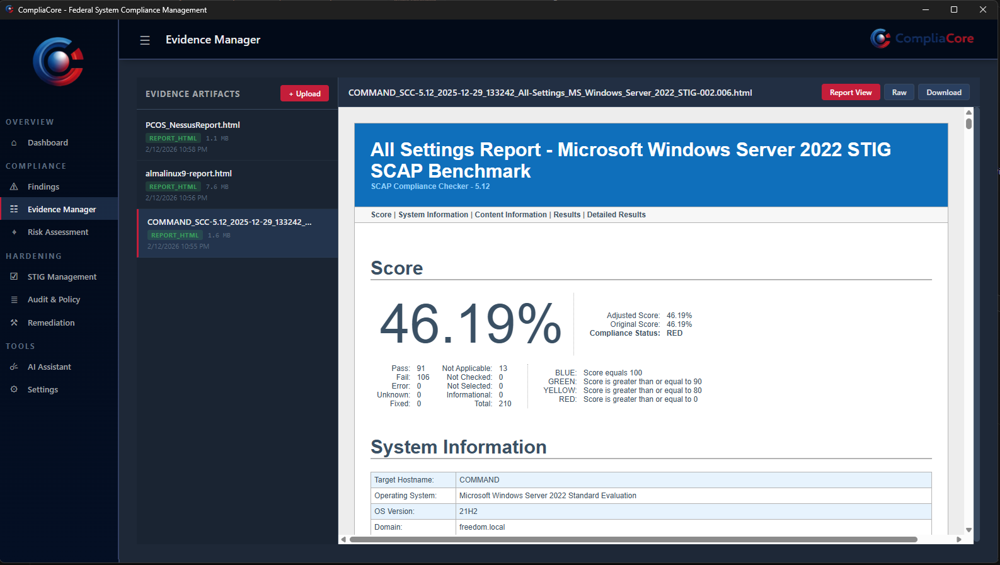

 

## 🤖 "ISSO Assistant" - Offline Retrieval Augmented Generation (RAG)
RAG-LM Agent built to deliver accurate, citation-backed guidance instructed to strictly leverage user-provided federal, organizational, and system documentation in order to empower cybersecurity knowledge and decision-making.

- Offline / air-gap capable
- Modular architecture
- Designed for mission environments
- Human-in-the-loop decision model
- Evidence-driven AI responses

#### 🤖 Functionality Showcase: NIST 800-53 Knowledge Validation

Demonstrates context-aware response using local knowledge sources.

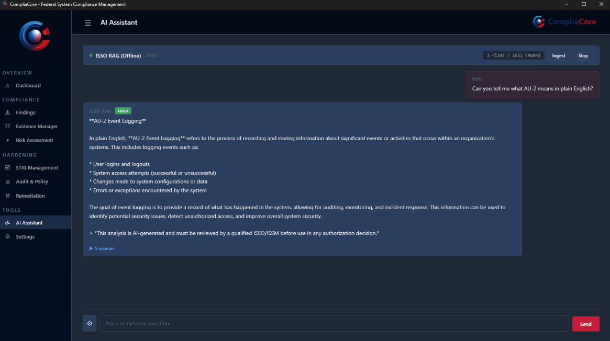

 

#### 🤖 Functionality Showcase: Citation Transparency & Confidence

Displays:

- Source document revealed for answer context
- Algorithmic, token/chunk-based confidence scoring  
- Retrieval details on selected KB content for validation  

Designed to support **human-reviewed authorization decisions**.

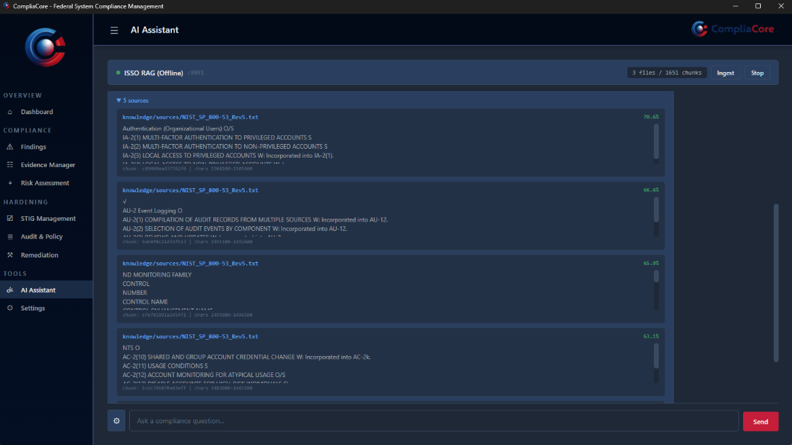

 

#### 🤖 Functionality Showcase: RMF Knowledge (NIST 800-37 Rev. 2)

Context-aware explanation of RMF lifecycle activities.

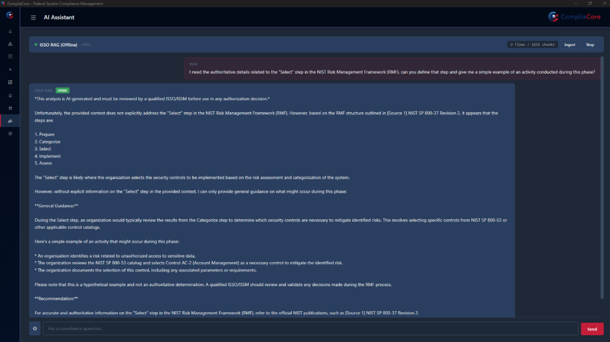

 

#### 🤖 Functionality Showcase: Evidence Traceability

Full citation context to support accuracy verification to authoritative RMF guidance.

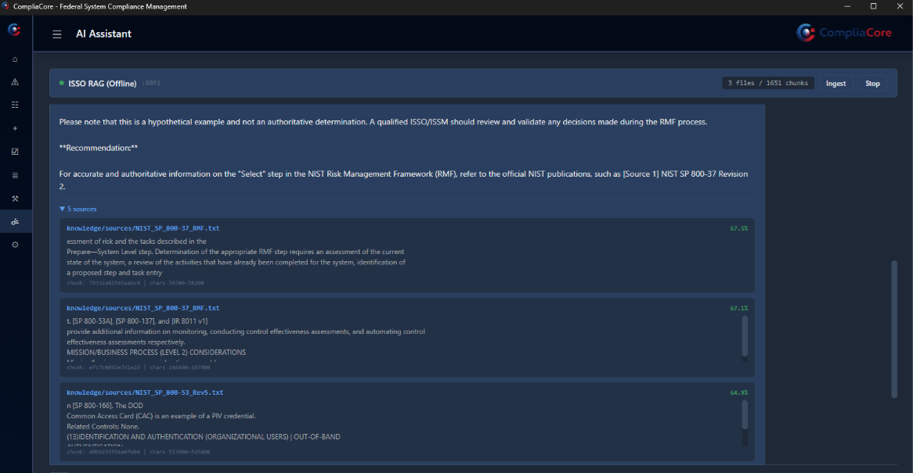
